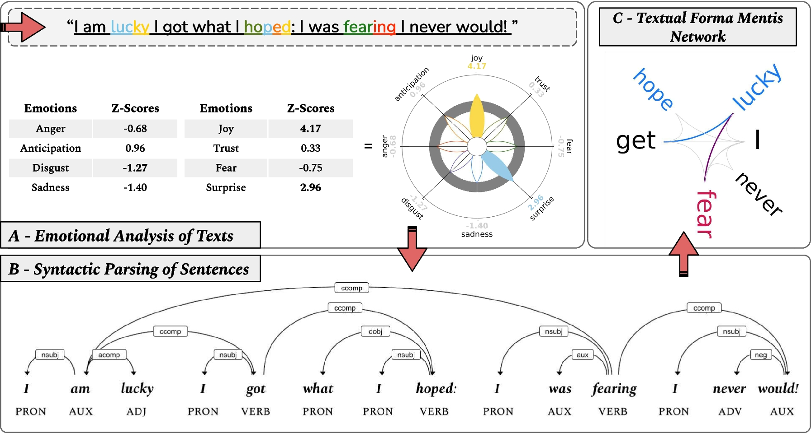

A Python library for the detection and visualization of emotions in texts, coming soon with the first release ✨


## Description

EmoAtlas is a Python library that checks against the input text, after having enriched it and structured as a semantic network, against the multilingual [NRC Lexicon](https://saifmohammad.com/WebPages/NRC-Emotion-Lexicon.htm). The library is built upon the [forma mentis Networks](https://journals.plos.org/plosone/article?id=10.1371/journal.pone.0222870) from Stella et al. and the [PyPlutchik library](https://www.github.com/alfonsosemeraro/pyplutchik) (paper [here](https://journals.plos.org/plosone/article?id=10.1371/journal.pone.0256503)).



It has already been used for our analysis of the [semantic and emotional frames around COVID-19 vaccines](https://arxiv.org/abs/2201.07538), repository [here](https://github.com/alfonsosemeraro/vaccines-and-press).

## Installation
emolib installs with pip:

```
~$ pip install emoatlas
```
then install the relevant language using:

```
~$ python -m spacy download en_core_web_lg
```
the command above installs English, but a list of possible language codes can be found [here](https://spacy.io/usage/models), and different languages installed by changing `en` in the final argument to one of the listed language codes. 

This library uses Natural Language Toolkit (NLTK) as a core dependency. If this is the first time you're using NLTK, you need to download its data depending on the language you are interested in.
```python
import nltk
nltk.download('wordnet') #English
```

## Usage and Guides
See the Jupyter notebooks in `demos/` for examples of how to use emoatlas ([Jupyter notebook](https://github.com/jupyter/notebook) required). **Guides and other information about the package are also available in that folder.**

#### Google Colab
A Google Colab simple demo is also available [here](https://colab.research.google.com/drive/1qzymy0-5EXv3E6dQ0c_D3mv8tyvjSduX?usp=sharing).

**It is suggested to refer to the guides of the `demos/` folder to understand how to use the package.**

## Acknowledgements
Thanks to [@FinleyGibson](https://github.com/FinleyGibson) and [@GiulioRossetti](https://github.com/GiulioRossetti) for their contribution to the testing, debugging and refactoring this library.
